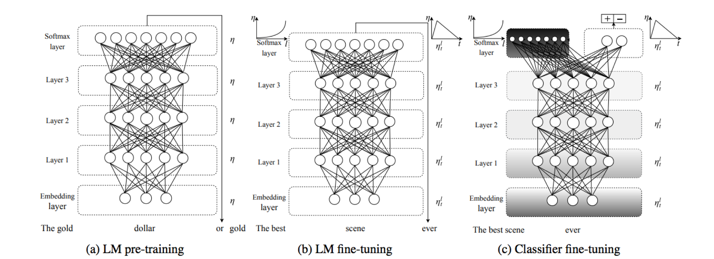

# Fine Tuning Language Models for Multi-label Text Classification

## Overview

Pre-training and generative modeling for improved language understanding for multi-task learning in NLP remains a challenging but interesting area. Currently, most SOTA NLP results are obtained by training end-to-end architectures for each language task. We examine how transformer models relying solely on attention modules, as well as convolution-only modules such as Q-RNN and QANet provide can be used effectively for generative language modeling and then fine-tuned for text classification as well as general multi-task problems. Of particular interest will be multi-label and hierarchical/structured output label classification where graph convolutional and value networks are more effective than binary categorical cross-entropy networks.

## Research Overview

In the past few months, a number of techniques utilizing pre-training, generative modeling, multi-task architectures, data augmentation using back-translation, and efficiency techniques in language modeling have been implemented that have allowed faster training and greater scope for transfer learning. In particular, the four papers listed below have i

1. [OpenAI: Improving Language Understanding by Generative Pre-Training](https://blog.openai.com/language-unsupervised/)
    * [code](https://github.com/openai/finetune-transformer-lm)
    * **_tldr_**: Train 
2. [fastAI: Universal Language Model Fine-tuning for Text Classification](http://nlp.fast.ai/classification/2018/05/15/introducting-ulmfit.html)
    - [code](https://github.com/fastai/fastai/tree/master/fastai) 
    * **_tldr_**: Pre-train a language model on generic English corpus (i.e., Wikipedia). Use that to initialize a new language model on your unlabeled domain-specific corpus. Fine-tune / initalize a new domain-specific architecture for text classification.

    

3. [Google Brain: QANet: Combining Local Convolution with Global Self-Attention for Reading Comprehension](https://arxiv.org/pdf/1804.09541.pdf)
    - [code](https://github.com/ni9elf/QANet)
    - **_tldr_**: Train a transformer based Q&A model consisting solely of convolutions and self-attentions. Convolutions model local interactions, and self-attention models global interactions. Use back-translation from Google NMT for data augmentation.
4. [AllenAI: Deep Contextualized Word Vectors](https://github.com/allenai/allennlp/blob/master/tutorials/how_to/elmo.md)
    - [code](https://github.com/allenai/allennlp/blob/master/tutorials/how_to/elmo.md)
        * [tensorflow implementation](https://github.com/allenai/bilm-tf)
    - **_tldr_**: Train a generic language model using Bidirectional-LSTM. 
    
5. [Salesforce Research, The Natural Language Decathlon](https://einstein.ai/research/the-natural-language-decathlon)
    - [code: github.com/salesforce/decaNLP](https://github.com/salesforce/decaNLP)

